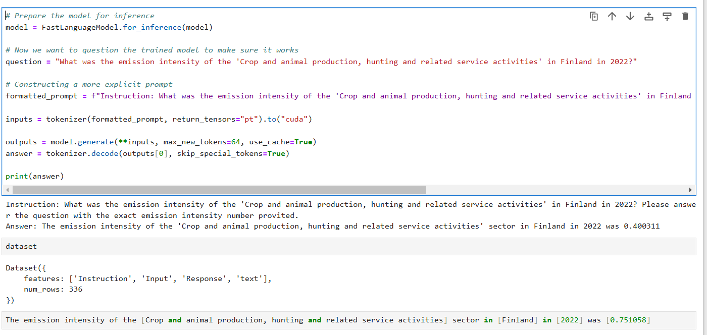
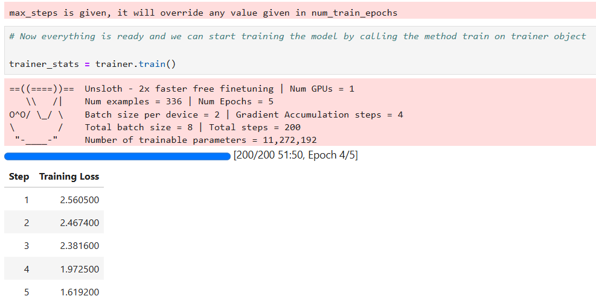

# LLaMa 3.2:1B Fine-Tunin
### // Python, LLM, Unsloth, Transformers, PEFT, Hugging Face

This project involves fine-tuning the LLaMA 3.2:1B model using Parameter Efficient Fine-Tuning (PEFT) for a specific task. The goal of the project is to adapt a pre-trained LLaMA model to work with a custom dataset, without the need for large amounts of labeled data.

## Overview

The project focuses on utilizing the LLaMA 3.2:1B model, a large language model developed by Meta, and applying fine-tuning techniques to adapt it for specific tasks. By using PEFT, we were able to achieve model customization with minimal data, improving its performance on domain-specific tasks.
Key components of the project include:
- Model Fine-Tuning: The pre-trained LLaMA model is fine-tuned using a custom dataset. We used LoRA (Low-Rank Adaptation), a technique within PEFT, to modify specific parts of the model and fine-tune it without retraining the entire model from scratch.
- Data Preparation: The data for training was formatted into a structured template to enable effective fine-tuning. The dataset consists of task-specific instructions, inputs, and responses, which are formatted and pre-processed to work with the model.
- Training and Optimization: We used Hugging Face's SFTTrainer for the training process, configuring various hyperparameters like batch size, learning rate, and optimizer. The training process was done using gradient accumulation and other techniques to improve model performance and prevent overfitting.
- Model Deployment: After fine-tuning, the trained model is saved in multiple formats for optimized deployment, including the GGUF format for efficient storage. The model can also be used for inference tasks to answer specific questions or generate responses based on new prompts.

  

## Features
- PEFT Fine-Tuning: Efficient fine-tuning on a custom dataset using the PEFT approach.
- Model Optimization: The trained model is saved in various formats for easy deployment.
- Inference: The model can be used to generate answers or responses based on specific instructions and input data.

## How It Works
1. Model Selection: The LLaMA 3.2:1B model is chosen as the base model for this project.
2. PEFT Application: Using LoRA, the model is adapted to better handle specific tasks with minimal data.
3. Dataset Preprocessing: A custom dataset is formatted into a structure with instructions, inputs, and responses for model training.
4. Model Training: The model is fine-tuned on the custom dataset, with hyperparameters set to optimize performance.
5. Model Saving: After fine-tuning, the model is saved in different formats (standard, GGUF, and merged) to ensure flexibility in deployment.
6. Inference: The model can be queried with custom prompts to generate relevant responses.

  

## Project Limitations
Due to the proprietary nature of the code used in the project, I cannot share the source code.
